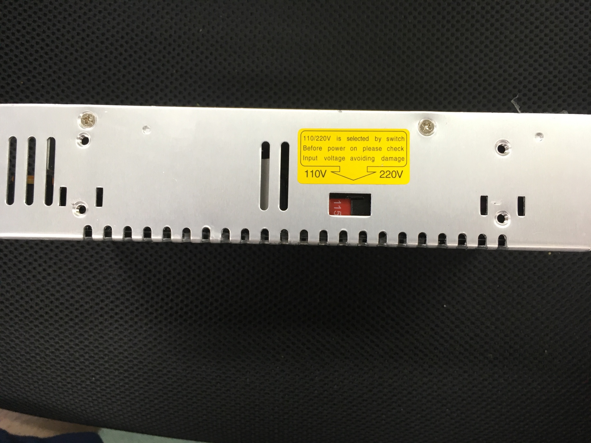
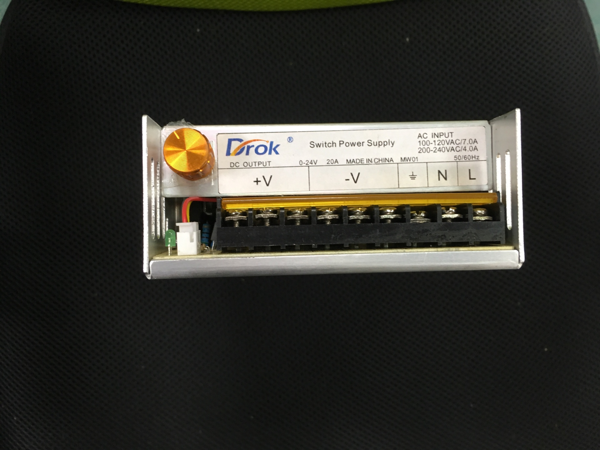
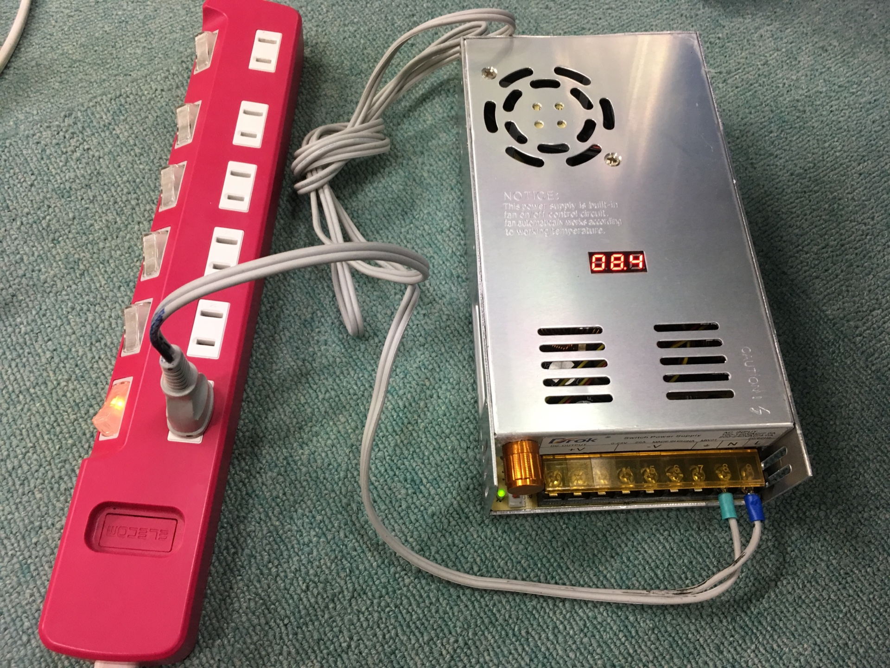

# 電源ユニット組み立て

## 電源供給について
下記のサイトにあるスイッチ電源を使用する
http://a.co/0NiRlu5
入力AC電圧 : 110 ~ 220V
出力DC電圧 : 0 ~ 48V
最大出力電流: 20A

## 供給電圧について
電源供給ユニットに供給する電圧レベルを設定する
日本のコンセントからの供給電圧はAC100V
以下の写真のように電圧を110Vに設定する

## IN/OUT PORTについて

OUTPUT PORT
* GND : 3ポート
* 正電圧 : 3ポート

INPUT PORT
* L端子 : 1ポート
* N端子 : 1ポート
* GND端子 : 1ポート

(＊ Input Portについては使用する国によってはコンセント供給する端子が異なるため気をつける)

## 電源供給について
コンセントケーブルを用意し、二本のケーブル線を二つに切り分ける。
先端部分に銅線用裸圧着端子（Y形）をハンダでつけ、片方をL端子、もう片方をN端子に接続
電源を入れると以下の写真のように中央部分に出力可能な電圧値が表示される
つまみ部分を回転させることで出力電圧を変化できる

