# RobotArm組み立て1

## 土台部分

#### 必要なパーツ
* 土台 x 1
* プリントパーツ x 4
* M5 LockNut x 4
* M5 六角穴付ボルト(25MM) x 4

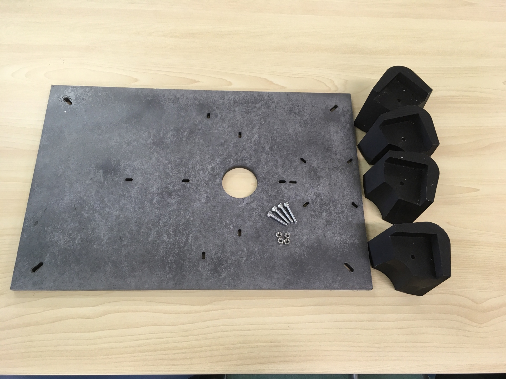
(＊土台の穴はドリルやレーザーカッターなどを用いて穴を開ける)

#### 手順1
###### 必要部品
* プリントパーツ x 4
* M5 LockNut x 4

###### 組み立て
プリントパーツ裏面からLockNutを挿入する
これを４つ分作成する

（※プリントの状態によってはLockNutが入らない時もあるので、半田ごてなどで少し溶かす）

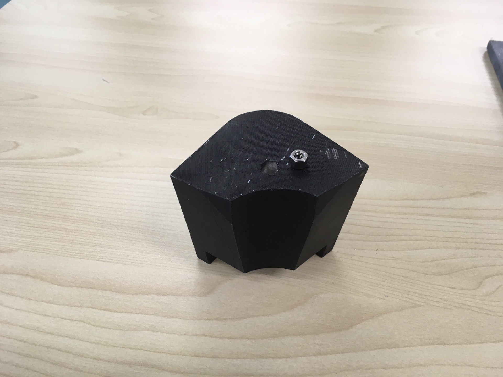

#### 手順2
###### 必要部品
* M5 六角穴付ボルト(25MM) x 4
* 土台部分 x 1

###### 組み立て
手順1で作成したものを土台の４つ角に設置
M5ボルトを各穴に下の部分のパーツと合うようにを締めて固定

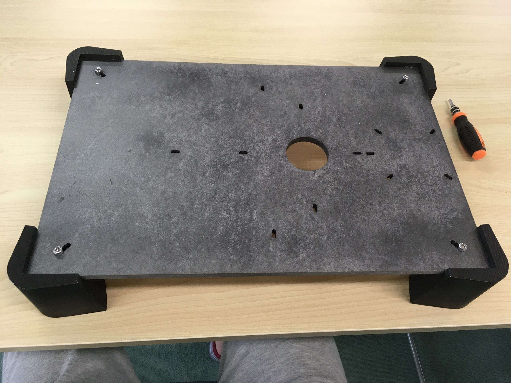

## RobotArmの土台の回転部分（プリント部分編1)
#### 必要なパーツ
* プリントパーツ x 1
* M4 六角穴付ボルト (40MM) x 4
* M5 LockNut x 8
* M4 LockNut x 4
* ベアリング(608ZZ) x 2

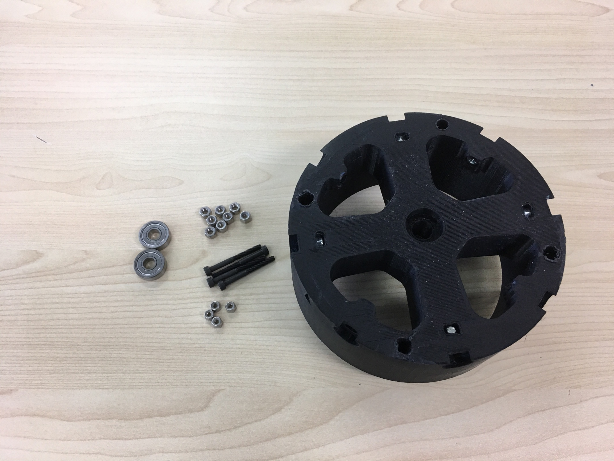

#### 手順1
###### 必要部品
* プリントパーツ x 1
* M5 LockNut x 8
* ベアリング(608ZZ) x 2
* M4 六角穴付ボルト (40MM) x 4

###### 組み立て
プリントパーツより８箇所下図の赤丸の穴にLockNutを入れる
M4六角穴付ボルトを４箇所下図の青丸の穴に入れる
ベアリングを上下２箇所に入れる。

（※プリントの状態によってはLockNutが入らない時もあるので、半田ごてなどで少し溶かしながら入れる）
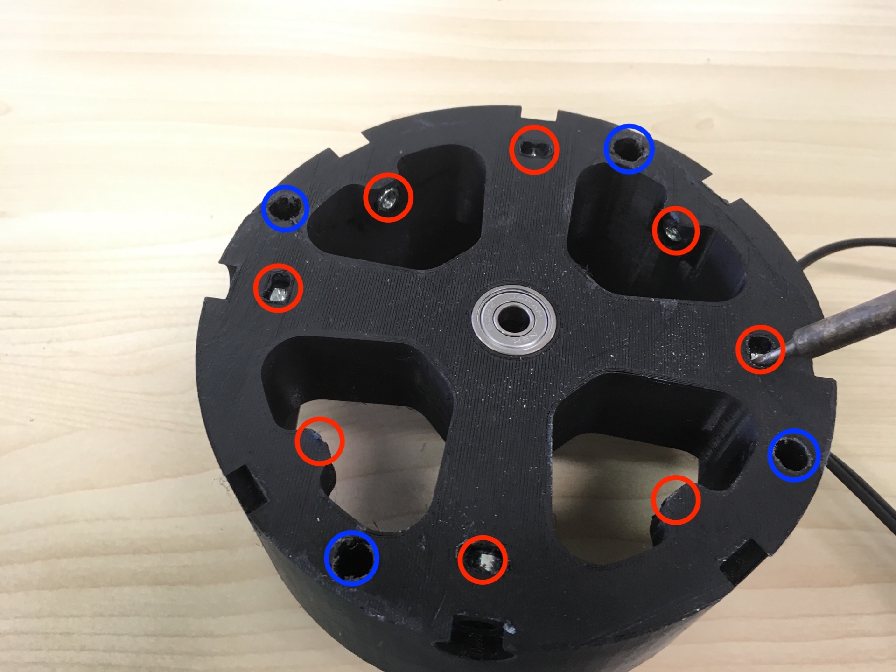

#### 手順2
###### 必要部品
* M4 LockNut x 4

###### 組み立て
手順1で作成したものと土台をあなに合わせて設置
土台の裏面から手順１で使用したM4六角穴付ボルトが突出しているのでM4LockNutで4箇所固定する

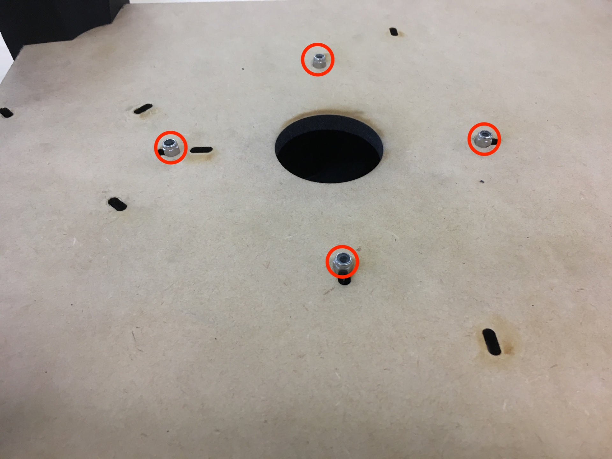

## RobotArmの土台の回転部分（プリント部分編2)
#### 必要なパーツ
* プリントパーツ x 1
* M8 六角ボルト(65MM) x 1
* M4 LockNut x 6
* M8 スペーサー x 1

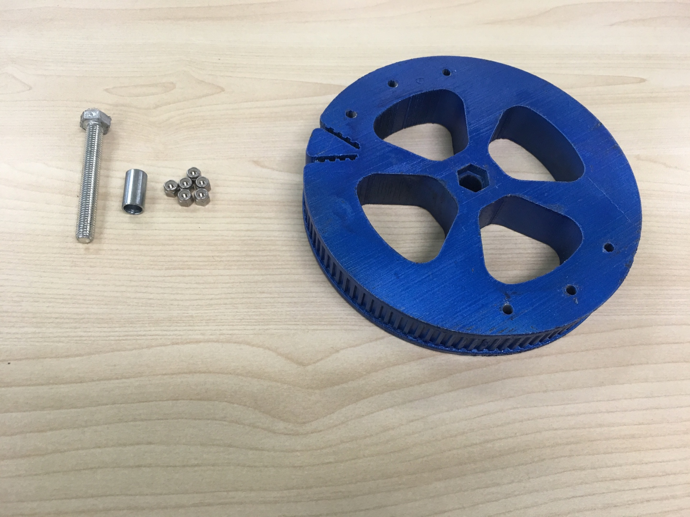

#### 手順1
###### 必要部品
* プリントパーツ x 1
* M4 LockNut x 6

###### 組み立て
プリントパーツにM4 LockNutを入れるスペースがあるのでそこにLockNutを入れる

（※組み立てる時にLockNutが落ちてしまう時などがあるので薄いセロテープなどで固定しておくとよい）

#### 手順2
###### 必要部品
* M8 六角ボルト(65MM) x 1
* M8 スペーサー x 1

###### 組み立て
M8六角ボルトにM8スペーサーを通して手順１で作成下ものの真ん中の穴に入れる
プリント部分編1で作成したものと合わせる

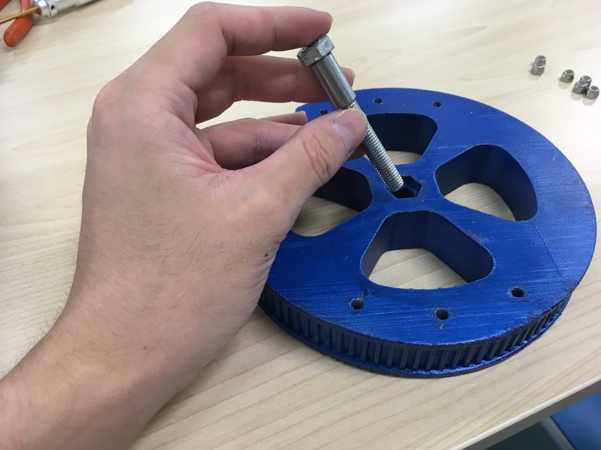

## RobotArmの土台の回転部分（プリント部分編3)
#### 必要なパーツ
* M5 六角穴付ボルト (14MM) x 8
* ベアリング(625ZZ)
* M5 スペーサー

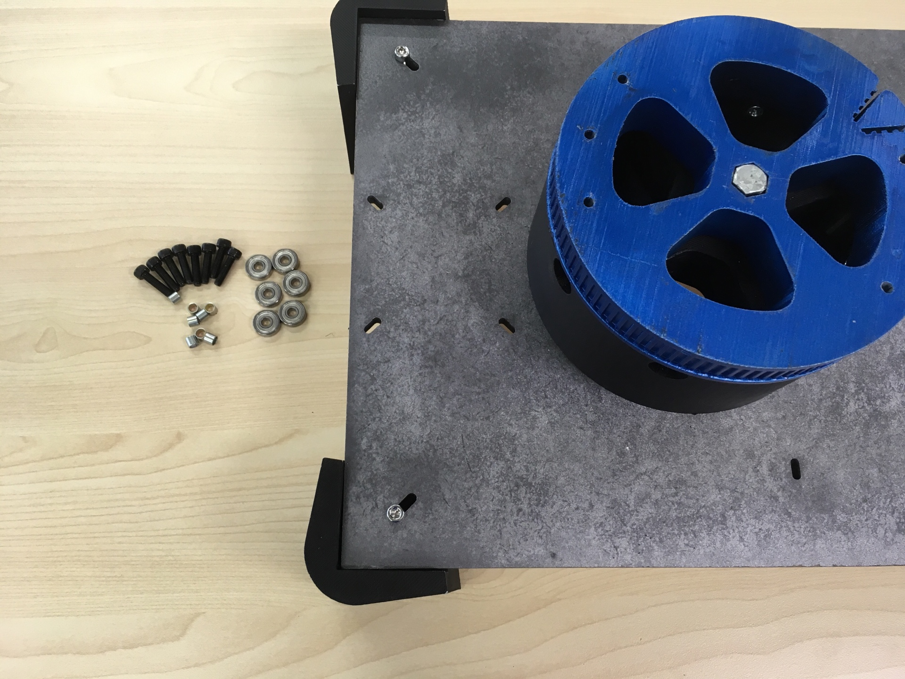

#### 手順1
###### 必要部品
* M5 六角穴付ボルト (14MM) x 8
* ベアリング(625ZZ) x 8
* M5 スペーサー x 8

###### 組み立て
以下の写真の通りそれぞの部品を合わせる
これを8個作成する

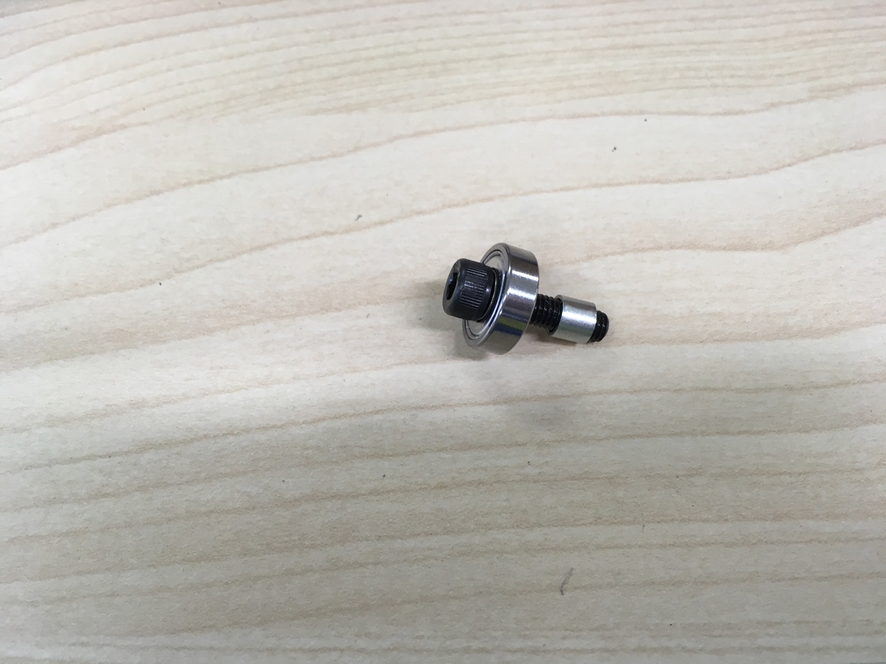

#### 手順2

###### 組み立て
プリント部分編2で作成したものとプリント部分編1で作成したものを合わせる。
側面部分にM5ボルト用の穴が8つあるのでそこに手順1で作成したものを入れ固定する

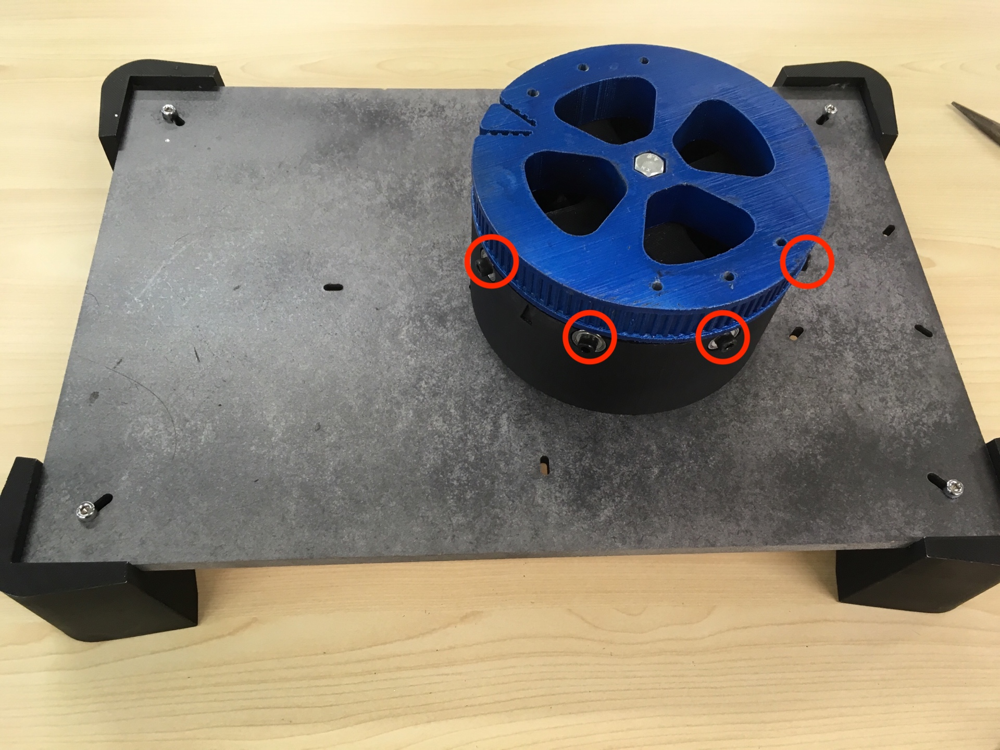

#### 手順3
###### 必要部品
* M8 Nut x 1

###### 組み立て
手順２より作成した後、土台の裏部分からM8六角ボルトの先端部分が出ているためそこをM8 Nutで固定する

（※強く締め過ぎてしまうと回らなくなるのであまりきつく締めない）

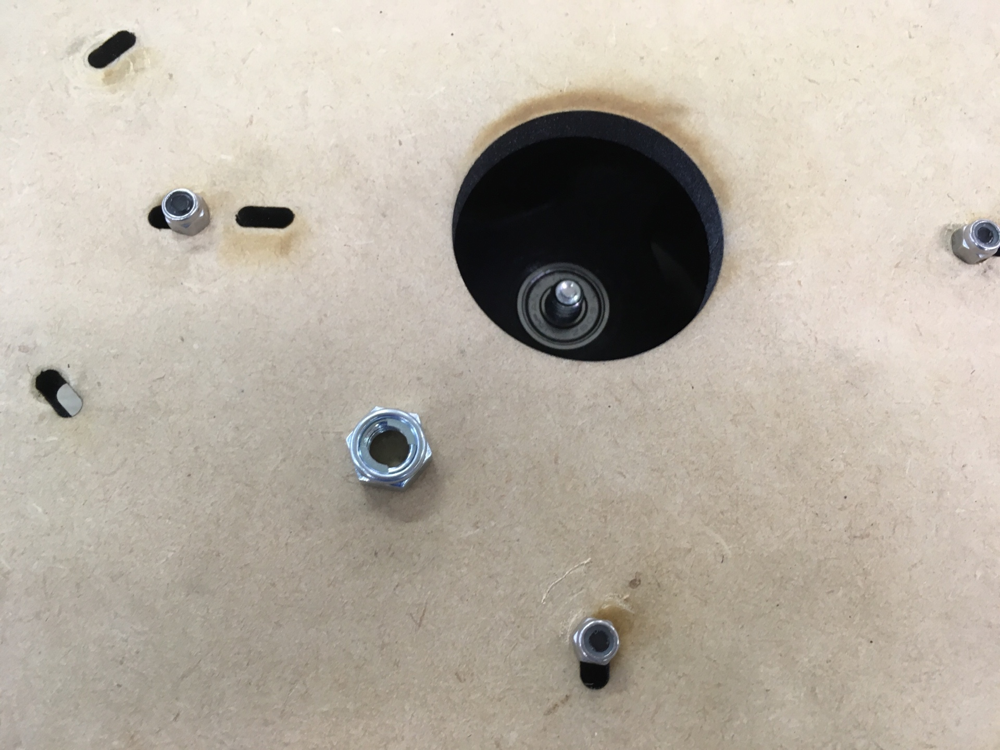

## RobotArmの土台の回転部分（モーター編)

#### 必要なパーツ
* プリントパーツ x 1
* ステッピングモーター x 1
* M3 六角穴付ボルト(10MM) x 4
* M4 六角穴付ボルト(25MM) x 4
* M4 Nut x 4
* M5プーリー x 1

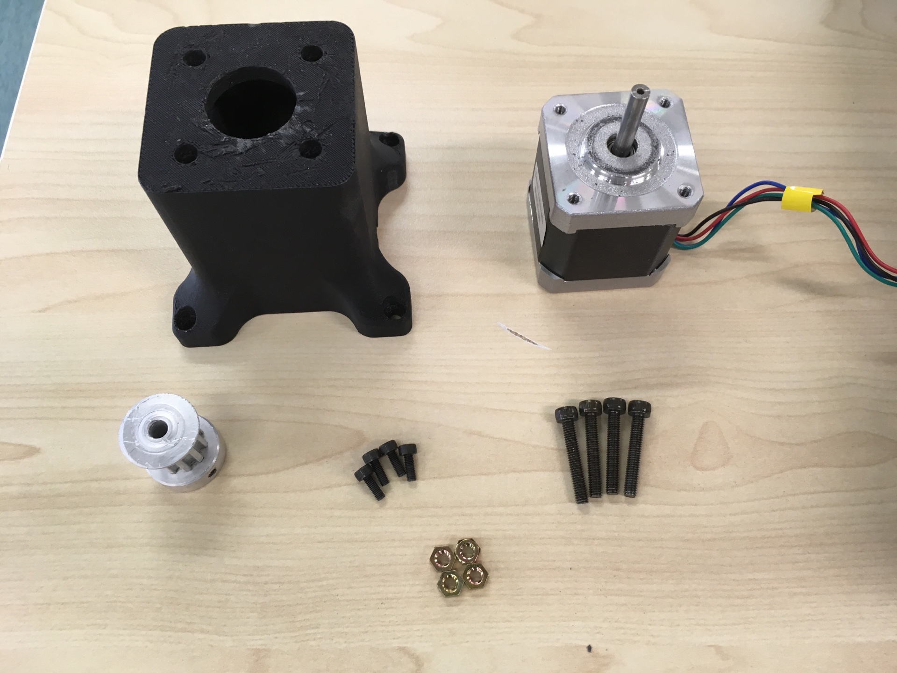

#### 手順 1
###### 必要部品

* ステッピングモータ x 4
* M5プーリー x 1

###### 組み立て
M5プーリーをステッピングモーターのシャフト部分に接続

（＊このときM5プーリーをステッピングモーターのシャフトがすべて覆われるように接続する）

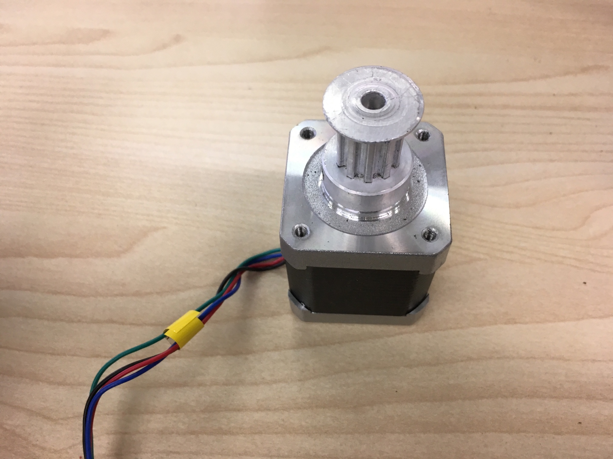

#### 手順 2
###### 必要部品
* プリントパーツ x 1
* M3 六角穴付ボルト(10MM) x 4

###### 組み立て
手順１で作成したものにプリントパーツを被せる
プリントパーツの穴からM3ボルトでステッピングモーターを固定

（※この時プーリーの歯車部分がプリントパーツで隠れないようにする）

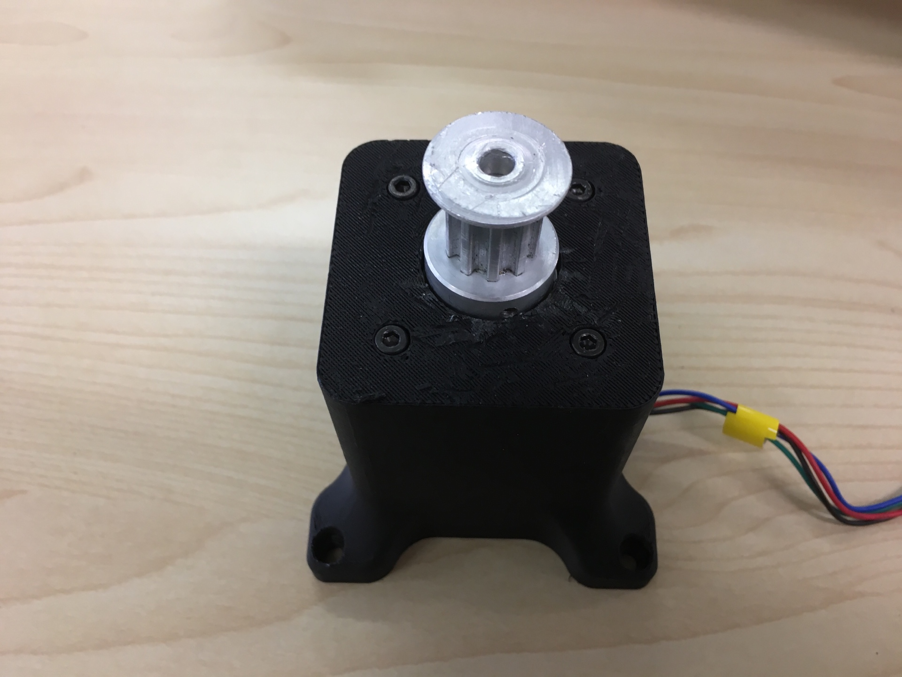

#### 手順 3
###### 必要部品
* M4 六角穴付ボルト(25MM) x 4
* M4 Nut x 4

###### 組み立て
手順２で作成したものと土台部分の穴の部分を合わせてM4六角穴付ボルトを入れてM4 Nutで計４箇所、固定する

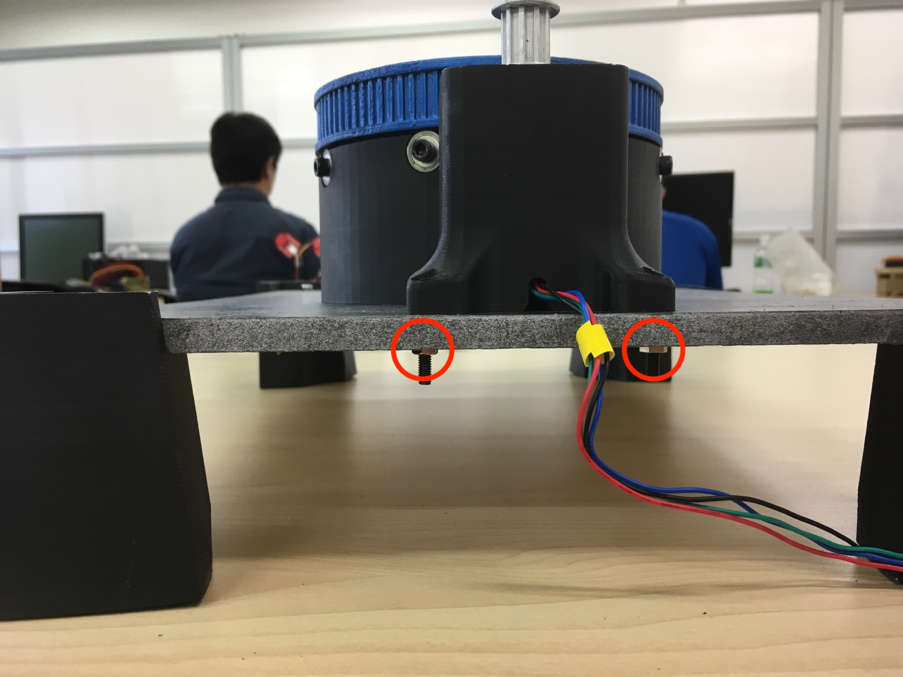

## RobotArmの土台の回転部分（完成編)
#### 手順 1
###### 必要部品
* ベルト

###### 組み立て
土台上モーターとRobotArmの土台部分をつなぎ回転させるためにベルトを用いて繋ぐ

（※ベルトはできる限りきつく張るように組み立てる<）

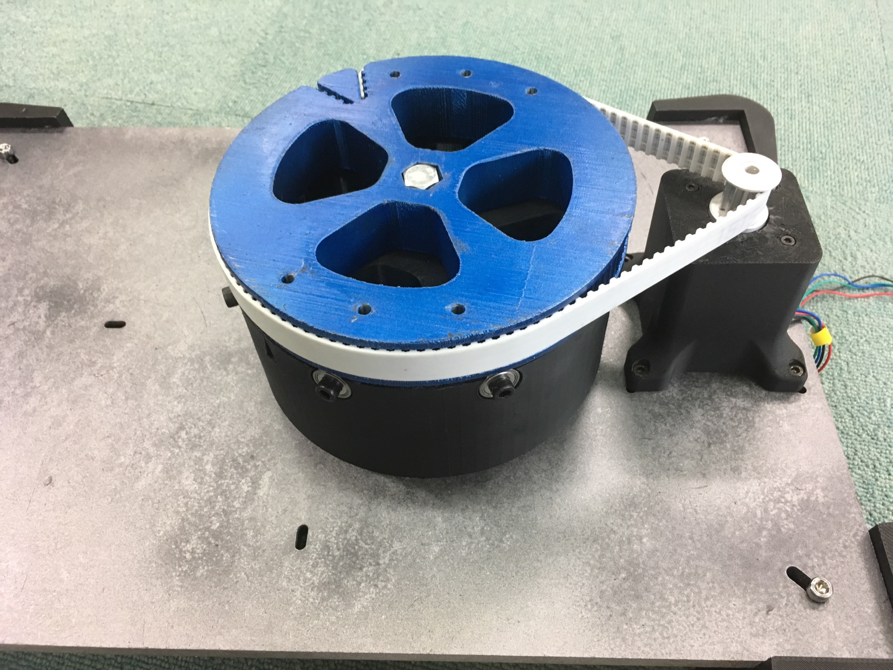
