# ロボットアーム組み立て方2

## 第一関節部分(軸部分)
#### 必要なパーツ
* プリントパーツ x 3
* ステッピングモーター x 2
* M3 六角穴付ボルト(25MM) x 2
* M4 六角穴付ボルト(45MM) x 6
* M5 六角穴付ボルト(14MM) x 8
* M5 Nut x 2
* M5 Lock Nut x 6
* M5 ベアリング(608ZZ) x 1
* M3 スクリューサート x 6
* M4 スクリューサート x 2

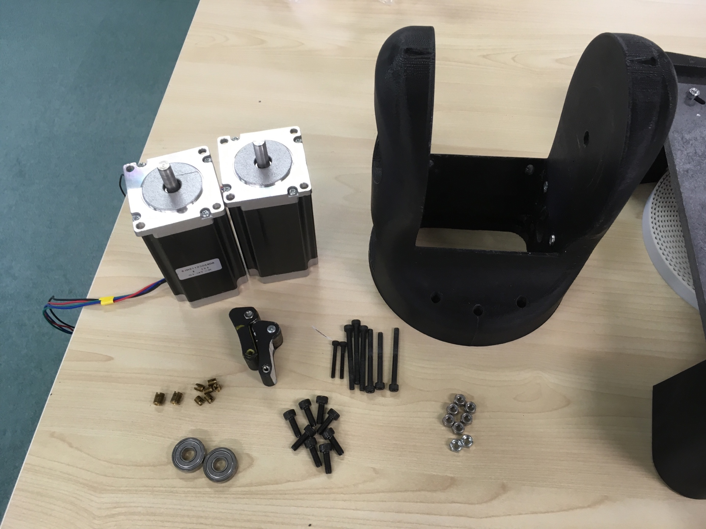

#### 手順１
###### 必要な部品
* プリントパーツ x 1
* ベアリング(608ZZ) x 2
* M3 スクリューサート x 6

###### 組み立て
プリントパーツの両面にスクリューサートとベアリングを組み込む
プリントパーツ両面に組み込む

(＊この時にプリント状態においては穴を広げる必要があるので、半田ごてなどで穴を広げる)
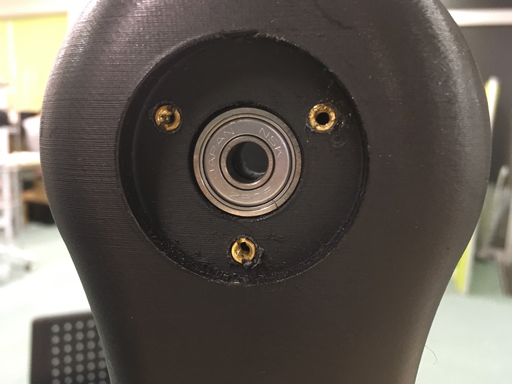

#### 手順２
###### 必要な部品
* M5 Nut x 2
* M5 Lock Nut x 6

###### 組み立て
プリントパーツにM5 LockNutを赤丸の所に,M5 Nutを青丸の所に組み込む 
(＊この時にプリント状態においては穴を広げる必要があるので、半田ごてなどで穴を広げる)
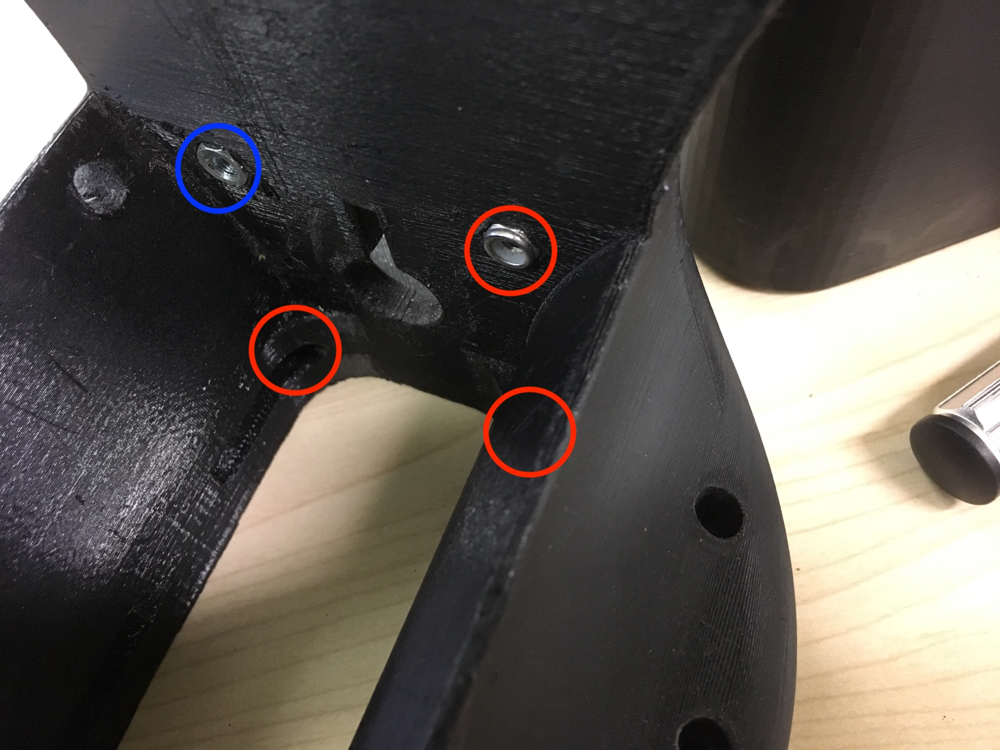

#### 手順3
###### 必要な部品
* プリントパーツ x 2
* M3 六角穴付ボルト(25MM) x 2

###### 組み立て
プリントパーツを以下の写真のように設置 
またこのプリントパーツを固定するために赤丸の所にM3ボルトを入れ固定 
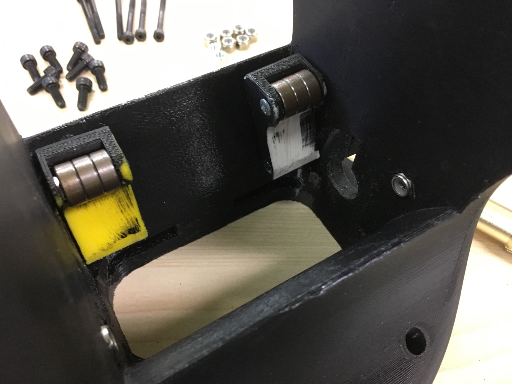

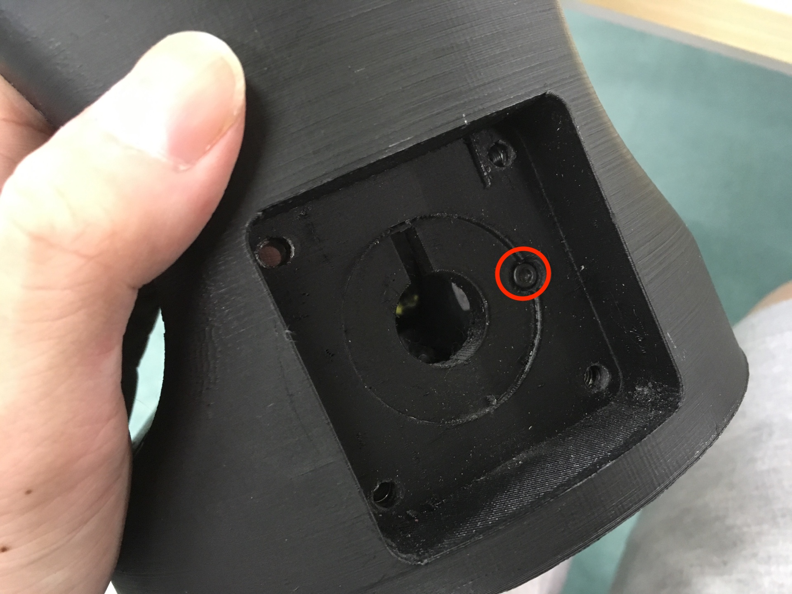

#### 手順4
###### 必要な部品
* ステッピングモーター x 2
* M5 六角穴付ボルト(14MM) x 8

###### 組み立て
ステッピングモーターの４つ角に合うようにM5ボルトを入れステッピングモーターを固定する 

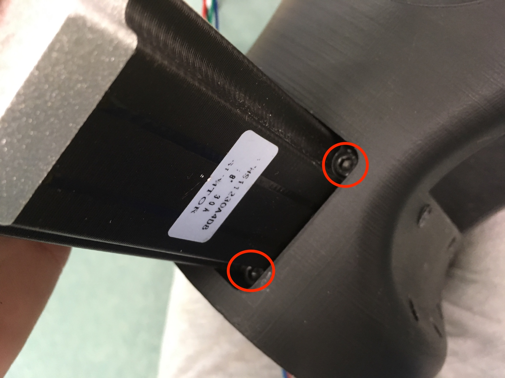

#### 手順5
###### 必要な部品
* M8 プーリー x 2

###### 組み立て
ステッピングモーターのシャフトの先端部分にM8プーリーをつける 
(＊できるだけM8プーリーをステッピングモーター側に寄せる)

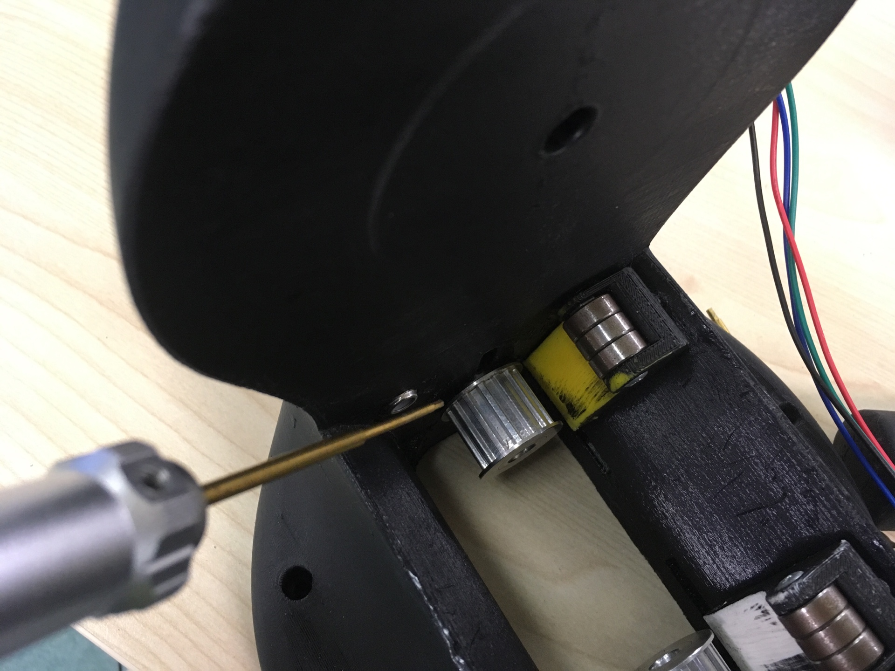

## 第一関節部分(回転部分)
#### 必要なパーツ
* プリントパーツ x 2
* M4 Nut x 4
* M4 角穴付ボルト(40MM) x 4
* M4 Lock Nut x 4

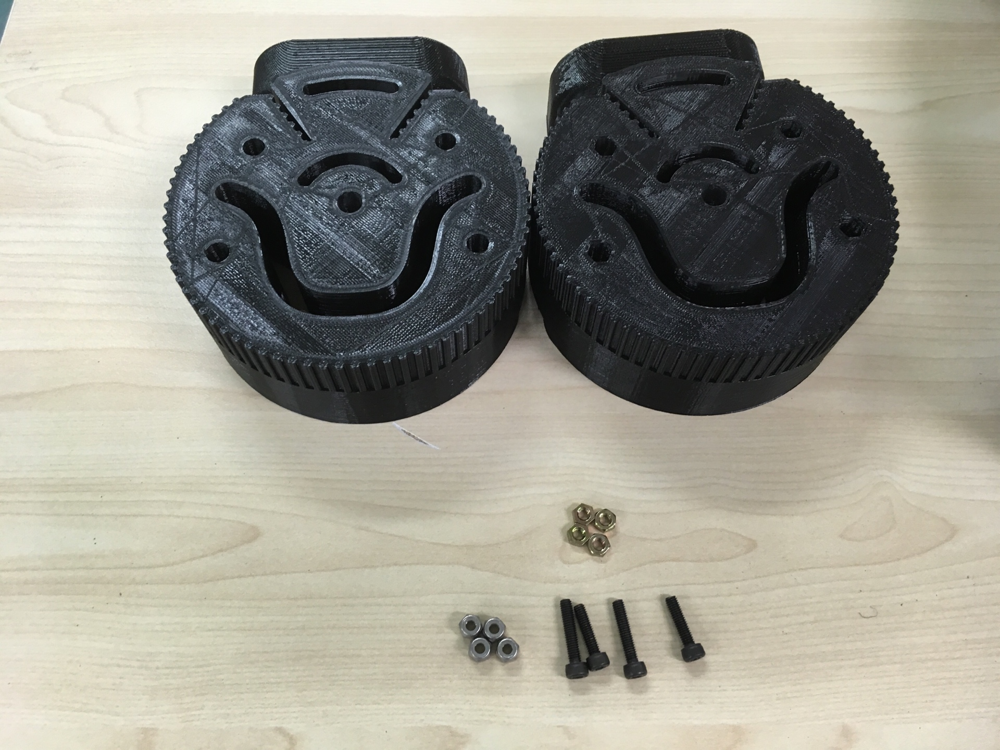

#### 手順1
###### 必要な部品
* M4 Nut x 4

###### 組み立て
プリントパーツの内側部分にM4 Nutを挿入
これは次のChapterで作成したやつと繋げるため

(＊この時にプリント状態においては穴を広げる必要があるので、半田ごてなどで穴を広げる)
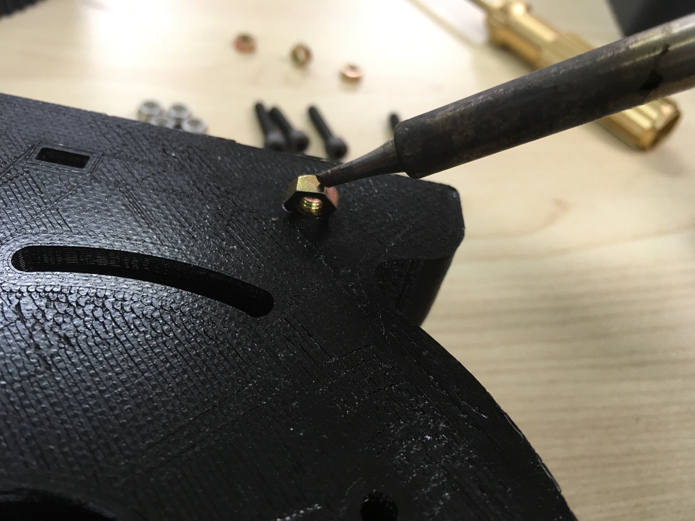

#### 手順2
###### 必要な部品
* M4 Lock Nut x 4
* M4 角穴付ボルト(40MM) x 4

###### 組み立て
赤丸の場所4箇所をM4のボルトとLock Nutを用いて固定する

(＊この時にプリント状態においては穴を広げる必要があるので、半田ごてなどで穴を広げる)
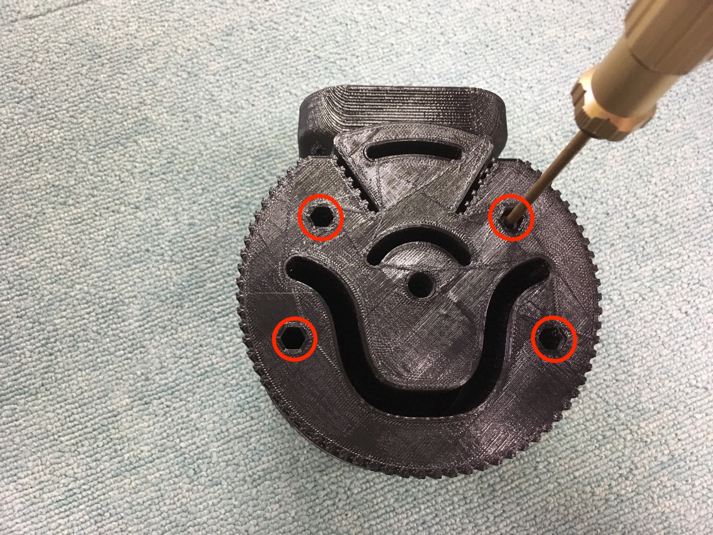

#### 手順3
###### 必要な部品
* ベルト

###### 組み立て
ベルトを用いて手順２で作成したものと第一関節部分(軸部分)で作成したものをベルトで繋げる

(＊この時なるべくベルトが張るようにベルトを閉める)
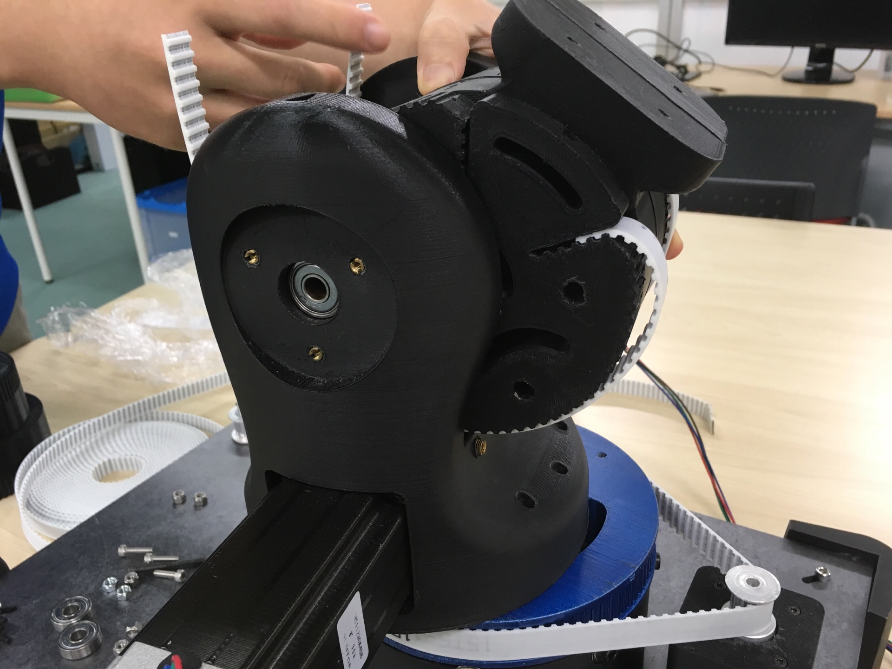

#### 手順4
###### 必要な部品
* シャフト(135MM) x 1

###### 組み立て
手順３でベルトを締めた後、回転部分の位置を固定させるためにシャフト挿入する

(＊この時にプリント状態においては穴を広げる必要があるので、ドリルなどを用いて広げる)
(＊シャフトの先端部分に凸部分ができている場合、ヤスリなどを用いて先端部分を丸くする)
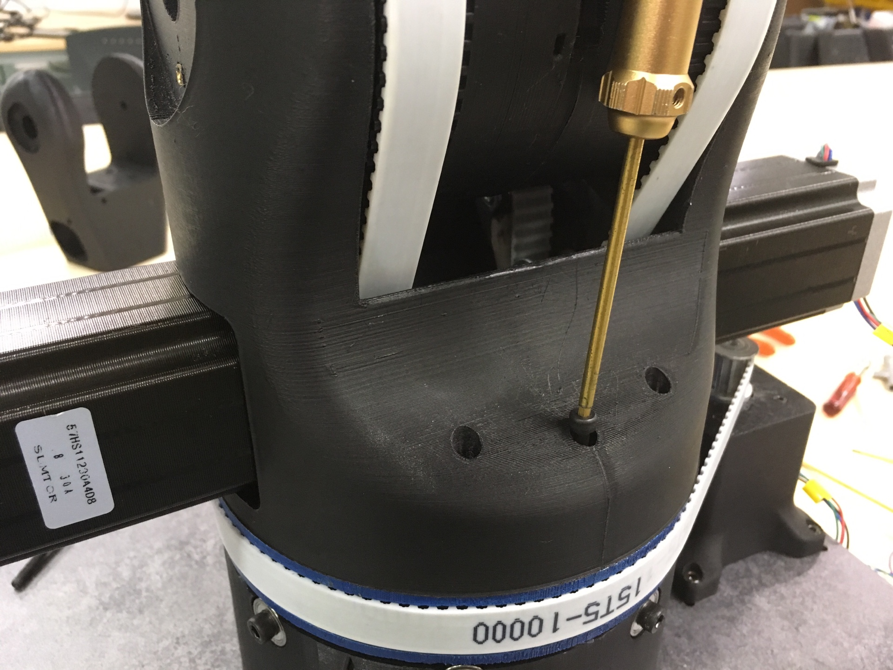

#### 手順5
###### 必要な部品
* M4 六角穴付ボルト(40MM) x 6

###### 組み立て
最後に手順4で作成したものと土台部分をM4ボルトを用いて固定し接続する

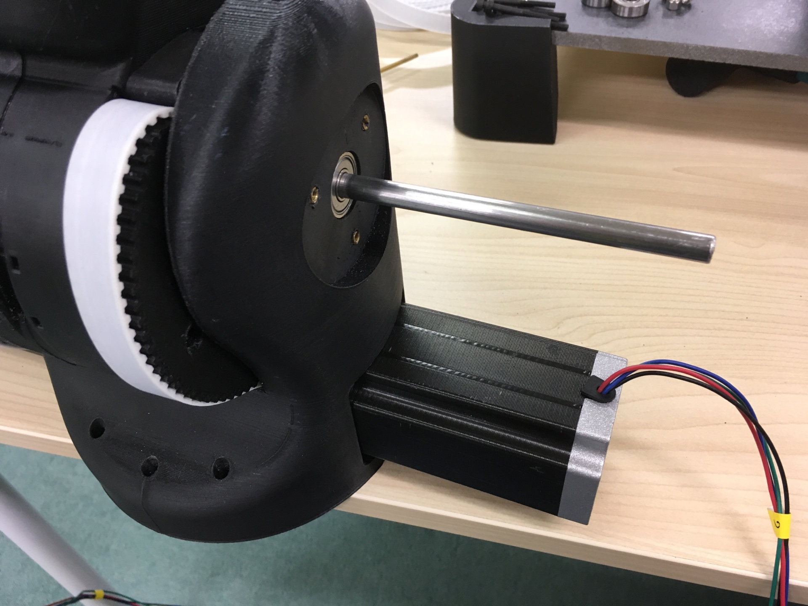

## 最終的な形
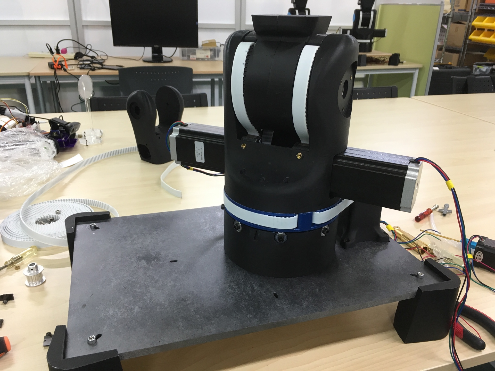
