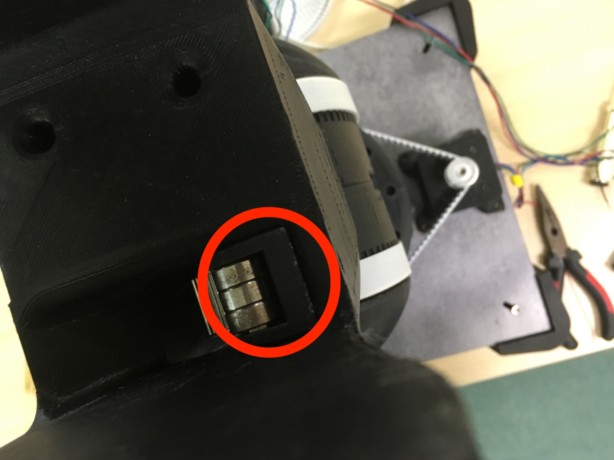

# ロボットアーム組み立て方3

## 第2関節部分
#### 必要なパーツ
* プリントパーツ x 1
* ステッピングモーター x 1
* M3 六角穴付ボルト(8MM) x 4
* M4 六角穴付ボルト(16MM) x 4
* M5 ベアリング(608ZZ) x 1
* M3 スクリューサート x 6
* M8 プーリー x 1

#### 必要なパーツ
* プリントパーツ x 1
* M3 六角穴付ボルト(40MM) x 1
* M3 Nut x 1

#### 手順１
###### 必要な部品
* プリントパーツ x 1
* M3 Nut x 1

###### 組み立て
プリントパーツの内側にM3 Nutを挿入するスペースに入れる

#### 手順2
###### 必要な部品
* プリントパーツ x 1
* M3 六角穴付ボルト(40MM) x 1

###### 組み立て
プリントパーツを赤丸の位置に設置し、青丸の部分からM3ボルトを用いて固定する

#### 手順3
###### 必要な部品
* M4 六角穴付ボルト(16MM) x 4

###### 組み立て
組み立て２まで作成したものと今回作成するプリントパーツを繋ぐためにM4のボルトを用いて４箇所止める

#### 手順4
###### 必要な部品
* ステッピングモーター x 1
* M3 六角穴付ボルト(25MM) x 4

###### 組み立て
ステッピングモーターを下の写真のように設置
固定するためにM3ボルトを用いる

#### 手順5
###### 必要な部品
* M8プーリー x 1

###### 組み立て
モーターのシャフト部分にM8プーリーを挿入する 
(＊この時になるべくプーリーがステッピングモーター側になるように固定する)

