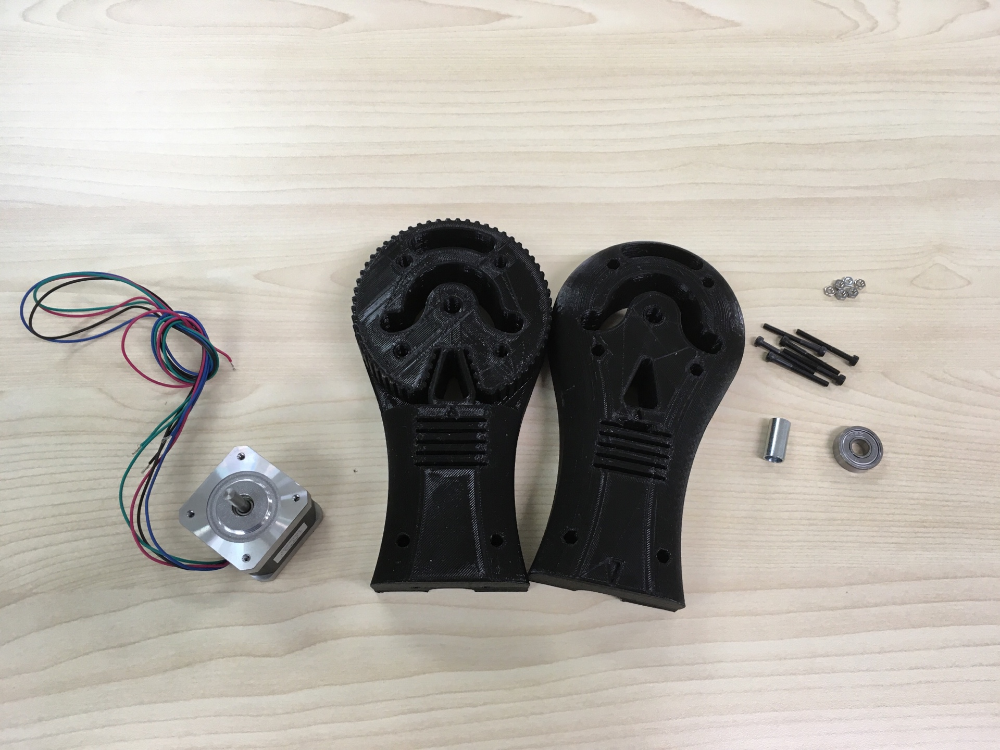
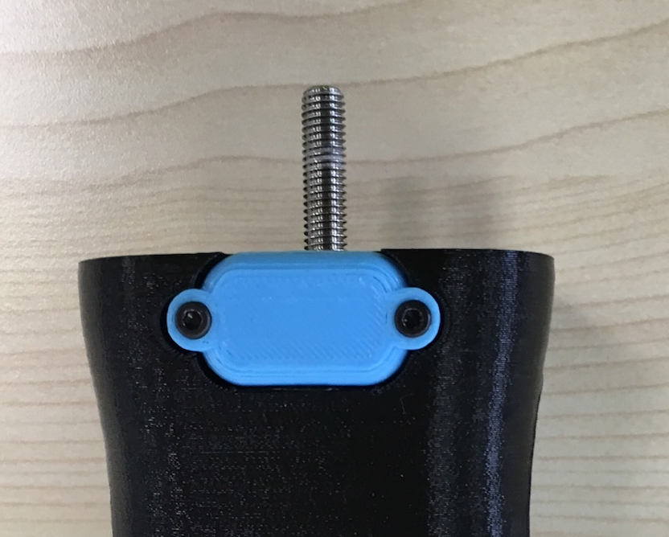
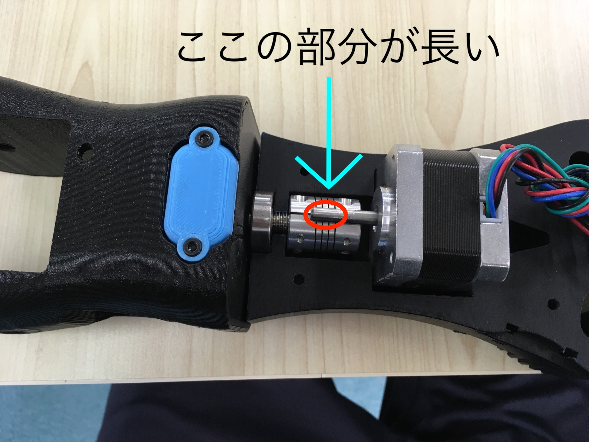
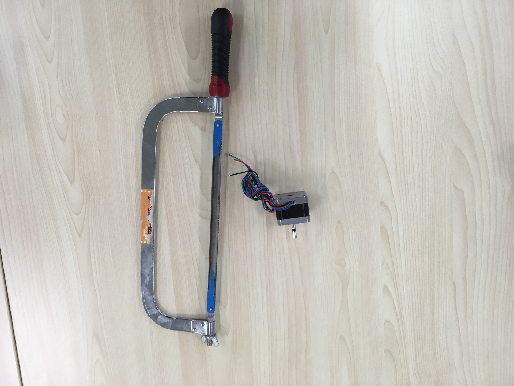
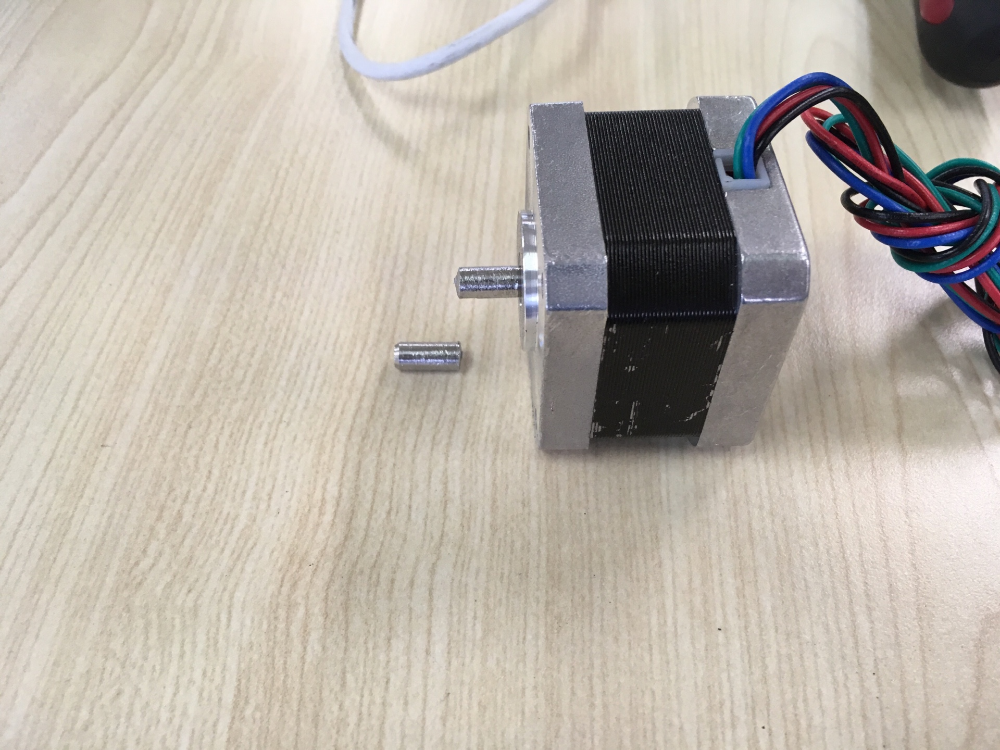
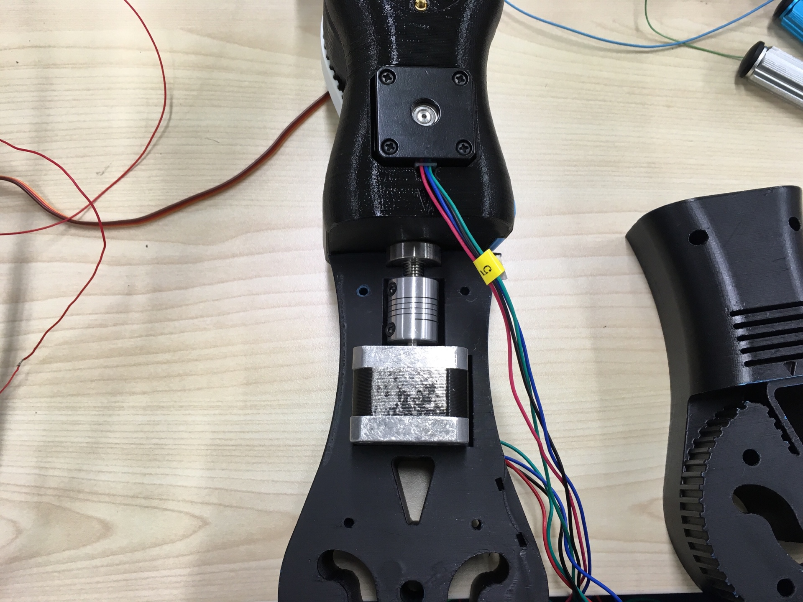
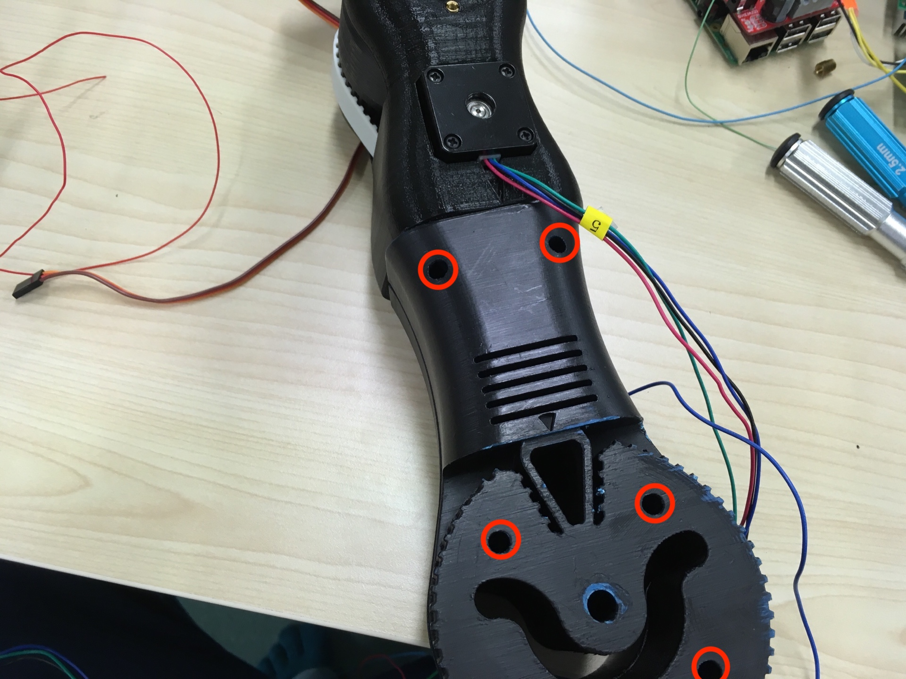
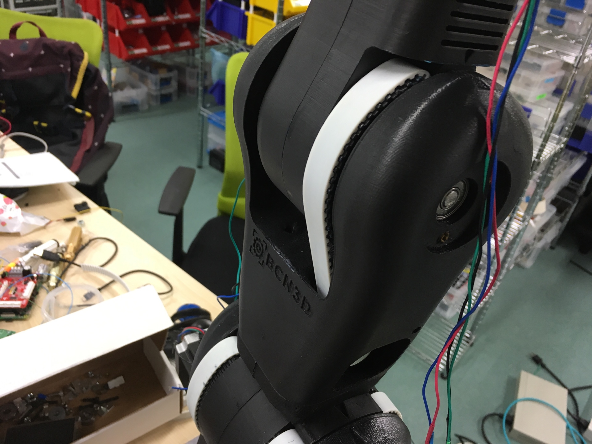

# ロボットアーム組み立て方5

## 第３関節部分

#### 必要なパーツ
* プリントパーツ x 2
* ステッピングモーター x 1
* M3 六角穴付ボルト(40MM) x 6
* M3 Nut x 6
* スペーサー x 1
* M5 ベアリング(608ZZ) x 1

#### 手順１
###### 必要な部品
* 寸切りx 1

###### 組み立て
chapter5で作成したパーツに寸切りを挿入する

#### 手順２
###### 必要な部品
* シャフト固定部品 x 1
* ステッピングモーター x 1

###### 組み立て
下図のように今回用いるモーターについてシャフトの長さは34mmが理想のためシャフト切断を次の手順で行う

#### 手順３
#### 必要なパーツ
* 鉄ノコギリ x 1
* ステッピングモーター x 1

###### 組み立て
シャフトをおおよそ4mmほど鉄ノコギリで切断する。
その後シャフト切断の先端部分をヤスリで削る

#### 手順4
###### 必要な部品
* ベアリング x 1

###### 組み立て
手順3で加工したステッピングモーターのシャフトとchapter5までで作成したパーツを合わせる。
このときペアリングを寸ぎりのところに設置する。

#### 手順5
###### 必要な部品
* プリントパーツ x 1
* M3 Nut x 6
* M3 六角穴付ボルト(40MM) x 6

###### 組み立て
プリントパーツを上から被せ、六ヶ所にM3 Nutとボルトを入れ固定させる 

#### 手順6
###### 必要な部品
* ベルト x 1
* シャフト x 1

###### 組み立て
手順5までに作成したパーツとChapter3までで作成したパーツをベルトを用いて回転、固定させる。 
またベルトで固定した後シャフトを入れて、固定させる。

