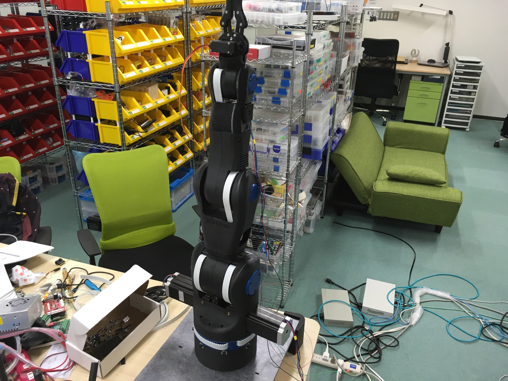

# ロボットアーム組み立てFinal

## サーボモーター部分

#### 必要なパーツ
* サーボモーター(MG946R) x 1
* M3 六角穴付ボルト(10MM) x 6

###### 組み立て
アームの部分にサーボモーターを固定する部分が存在するため、そこにサーボモーターを設置する。
M3ボルトを４箇所設置できる場所が存在するためそこにM3ボルトを入れて固定する。

## 側面部分

#### 必要なパーツ
* プリントパーツ x 6
* M3 六角穴付ボルト(10MM) x 18

###### 組み立て
アームの側面部分に六ヶ所青いカバー用のプリントパーツを設置する場所が存在するため、そこにプリントパーツを設置する。

## 完成形
全体図

