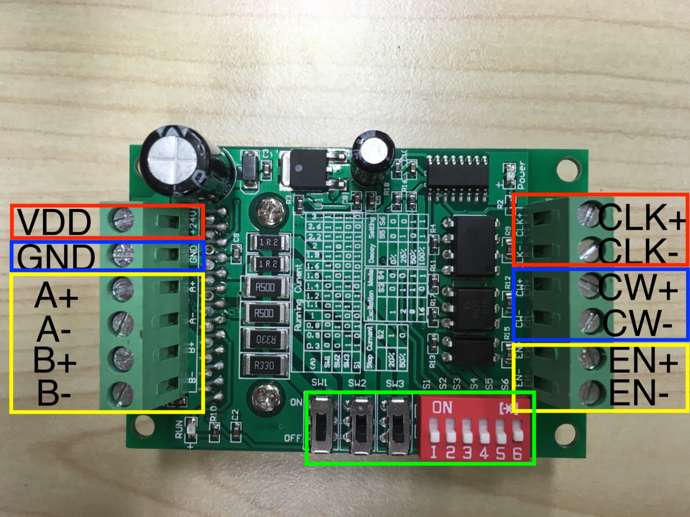

# Robot Arm制御１<モータードライバ編>

## 使用するモータードライバ
BL_TB6560-V2.0

#### 特徴 :
* 0 ~ ３Aまでの電流供給
* 0 ~ 24Vまでの電圧対応
* 基準電圧 : 5V
* 対象ステッピングモーター : バイポーラステッピングモーター

#### 概要説明 :
###### 電圧源端子
* VDD端子 : 電圧端子(0 ~ 24V)
* GND端子 : GND端子

###### モーター接続端子
* A+,A-端子 : ステッピングモーター A相端子
* B+,B-端子 : ステッピングモーター B相端子

###### 制御端子
* CLK : モーター動作パルス端子
* CW : モーター回転方向端子
* EN : モーター動作許可端子

###### スイッチ
* SW1, SW2, SW3, S1 : モーター供給用の電流を指定
* S2 : モーターシャフトを停止位置に保持するための電流指定
* S3, S4 : ステップ角分割指定
* S5, S6 : 電圧が変化した時のモーターコイルの減衰電流

#### 使用方法 :
1 : 電源端子にモーターに供給する電源を接続
2 : ステッピングモーターのPhaseを基準にモータードライバのA,B端子に合わせて接続する。
3 : 制御端子のー端子にはGNDを割り当てる。
(＊基準電圧が5VのためGPIOピンからの出力電圧が5Vのマイコンを使用するのが推奨)
4 : 制御端子にモーターを制御するデバイス(マイコンなど)と接続する
* CLK端子に供給したパルスを元にステッピングモーターは回転動作をおこなう。
* CW端子にHIGH(5V)を供給した時は反時計,LOW(0V)を供給した時は時計周りに回転する
(＊ステッピングモーターとの接続次第で回転方向は変化する)
* EN端子にHIGH(5V)を供給した時はモーター動作停止,LOW(0V)を供給した時はモーター動作許可

5 : モーターを動作させたい条件に合わせてスイッチを変更する
(＊各ステッピングモーターの特性に合わせて設定を行う。)

